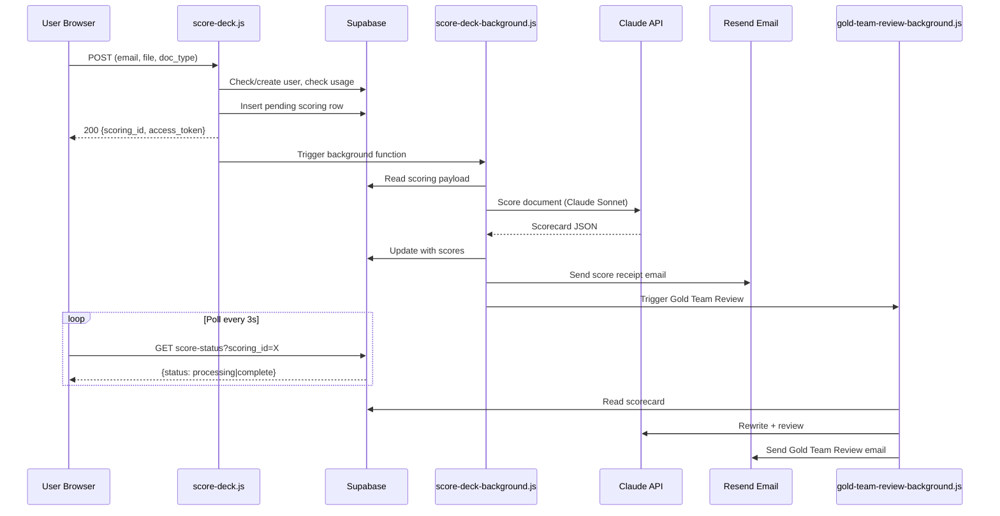
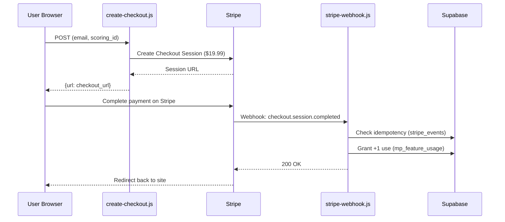

# Architecture

## System Overview

```mermaid
graph TB
    subgraph Users
        Browser[User Browser]
        Agents[OpenClaw Agents]
    end

    subgraph Netlify CDN
        Static[Static Pages<br/>index.html, about.html,<br/>proposal-pulse.html,<br/>marketpulse.html, etc.]
        Assets[Assets<br/>CSS, JS, Images, Fonts]
    end

    subgraph Netlify Functions
        SD[score-deck.js<br/>ProposalPulse Gateway]
        SDB[score-deck-background.js<br/>Scoring Engine]
        SS[score-status.js<br/>Status Polling]
        GTR[gold-team-review-background.js<br/>Gold Team Review]
        MPG[marketpulse-gateway.js<br/>MarketPulse Gateway]
        GTBB[generate-tactical-brief-background.js<br/>Report Generator]
        AB[agent-bridge.js<br/>Agent API Bridge]
        CO[create-checkout.js<br/>Stripe Checkout]
        SW[stripe-webhook.js<br/>Payment Webhook]
        HC[health.js / health-check.js<br/>Health Monitoring]
        WR[weekly-report.js<br/>Weekly Digest]
        CIR[contract-intel-refresh.js<br/>Contract Intel]
        BS[billing-sync.js<br/>Billing Sync]
    end

    subgraph External Services
        Supabase[(Supabase<br/>PostgreSQL)]
        Stripe[Stripe<br/>Payments]
        Resend[Resend<br/>Email]
        Anthropic[Anthropic<br/>Claude API]
        Perplexity[Perplexity<br/>Research API]
        OpenAI[OpenAI<br/>API]
        Sentry[Sentry<br/>Error Tracking]
    end

    Browser -->|HTTPS| Static
    Browser -->|HTTPS| Assets
    Browser -->|POST| SD
    Browser -->|GET| SS
    Browser -->|POST| MPG
    Browser -->|POST| CO
    Browser -->|GET| HC

    SD -->|triggers| SDB
    SDB -->|triggers| GTR
    MPG -->|triggers| GTBB

    SD --> Supabase
    SDB --> Supabase
    SDB --> Anthropic
    SS --> Supabase
    GTR --> Supabase
    GTR --> Anthropic
    MPG --> Supabase
    MPG --> Stripe
    GTBB --> Supabase
    GTBB --> Anthropic
    GTBB --> Perplexity
    AB --> Supabase
    CO --> Stripe
    SW --> Supabase
    WR --> Supabase
    WR --> Resend
    CIR --> Supabase
    CIR --> Anthropic
    BS --> Supabase
    BS --> Stripe

    SDB --> Resend
    GTR --> Resend
    GTBB --> Resend

    SDB --> Sentry
    MPG --> Sentry
    AB --> Sentry

    Agents -->|Bearer token| AB

    Stripe -->|webhook| SW
```

## Request Flows

### ProposalPulse Scoring Flow

### Payment Flow

## Shared Libraries (netlify/functions/lib/)

| Module | Purpose |
|--------|---------|
| `logger.js` | Structured JSON logging |
| `sanitize.js` | HTML stripping, length limits, prompt injection detection |
| `rate-limiter.js` | Token bucket rate limiting via Supabase |
| `sentry.js` | Sentry initialization + `wrapHandler()` |
| `workflow-state.js` | Order state machine with valid transitions |
| `kill-switch.js` | Feature kill switches |
| `model-router.js` | AI model selection routing |
| `cost-tracker.js` | API cost tracking |
| `send-email.js` | Resend API wrapper |
| `email-templates.js` | HTML email templates |
| `document-types.js` | ProposalPulse document type configs |

## Scheduled Functions

| Function | Schedule | Purpose |
|----------|----------|---------|
| `weekly-report` | Mon 9AM ET | Usage digest email |
| `rebuild-trigger` | Every 4h | Trigger site rebuild |
| `contract-intel-refresh` | Daily 6AM ET | AI contract research |
| `opportunity-radar` | Every 4h | SAM.gov opportunity polling |
| `score-cleanup` | Every 30m | Clean stale scoring records |
| `health-check` | Every 6h | System health audit |
| `ops-health-check` | Every 30m | Ops monitoring |
| `daily-stats-rollup` | Daily midnight | Stats aggregation |
| `billing-sync` | Daily 3AM ET | Stripe billing sync |
| `cost-rollup` | Daily 2AM ET | API cost aggregation |
| `sentry-sync` | Every 30m | Pull Sentry issues |
